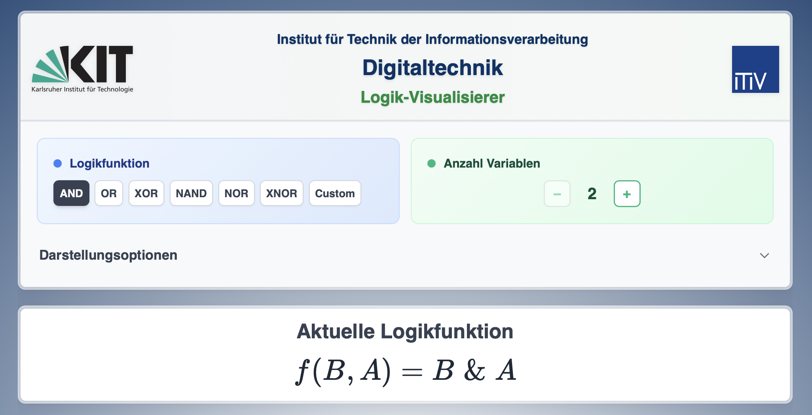
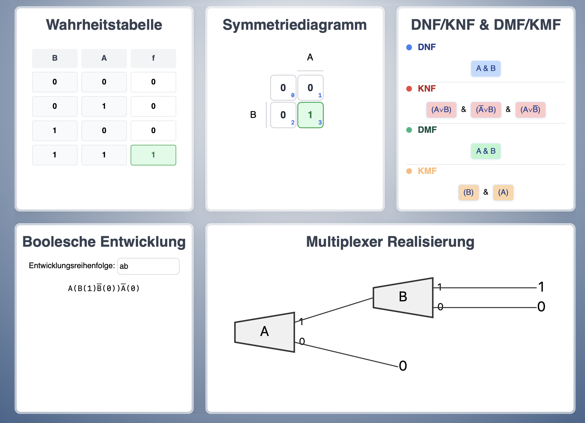

# DT-Visualisierer - Projektübersicht

## Kurzbeschreibung
Webbasiertes Tool zur Visualisierung und Analyse digitaler Schaltfunktionen für die Digitaltechnik-Lehre am KIT. Das System ermöglicht die Darstellung, Analyse und Konstruktion Boolescher Funktionen in verschiedenen Repräsentationsformen.

---

## Zielgruppe
- **Studierende der Informatik und Elektrotechnik**: Erlernung digitaler Schaltungsdesigns, Boolescher Algebra und Minimierungsverfahren in Grundlagenkursen
- **Lehrpersonal im Bereich Digitaltechnik**: Demonstration von Zusammenhängen in Vorlesungen und Übungen sowie Vorbereitung von Lehrmaterialien

---

## Kernfunktionen

### Darstellungsformen
- **Wahrheitstabellen**: Tabellarische Auflistung aller Eingabe-Ausgabe-Kombinationen mit konfigurierbarer Variablenanordnung
- **Symmetriediagramme**: Grafische Repräsentation funktionaler Symmetrien basierend auf Permutationsgruppen zur Visualisierung von Invarianzen
- **Normalformen**: Automatische Generierung disjunktiver (DNF) und konjunktiver (KNF) Normalformen
- **Minimalformen**: Implementierung des Quine-McCluskey-Algorithmus zur Bestimmung minimaler Schaltungsrealisierungen
- **Multiplexer-Implementierungen**: Hardware-orientierte Darstellung mit Steuer- und Dateneingängen
- **Boolesche Entwicklung**: Darstellung der Booleschen Entwicklung von Funktionen

### Eingabe und Manipulation
- **Vordefinierte Funktionen**: Bibliothek grundlegender n-stelliger Boolescher Funktionen (AND, OR, XOR, NAND, NOR, NOT)
- **Ausdrucksparser**: Syntaxvalidierung und Interpretation benutzerdefinierter logischer Ausdrücke mit Unterstützung für Operatorpräzedenz
- **Bearbeitung**: Manipulation von Wahrheitswerten durch Klick-Interface mit automatischer Aktualisierung aller Darstellungsformen
- **Referenzierung**: Hervorhebung korrespondierender Elemente zwischen verschiedenen Visualisierungen

---

## Projektdaten

| Parameter              | Wert                      |
|------------------------|---------------------------|
| **Version**            | 1.0.0                     |
| **Entwicklungsbeginn** | 14.07.2025                |
| **Stand**              | 13.08.2025                |
| **Autoren**            | Jan Repp, Henri Schulz    |
| **Institution**        | ITIV, KIT                 |
| **Lizenz**             | MIT                       |

## Screenshots

**Konfigurationsbereich**

**Darstellungsformen**
